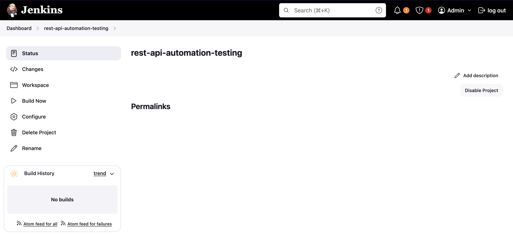
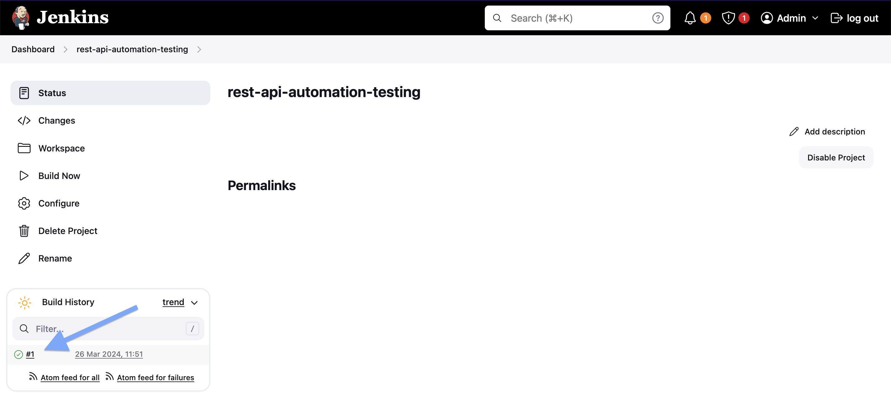

# jenkins-dind-postman-newman

The goal of this project is to implement an **Automation Testing** for a fake online REST API called [`ReqRes`](https://reqres.in). We will use:
- [`Jenkins`](https://jenkins.io), a self-contained, open source automation server which can be used to automate all sorts of tasks related to building, testing, and delivering or deploying software;
- [`Docker-in-Docker (dind)`](https://hub.docker.com/_/docker) to execute `Docker` commands inside `Jenkins`;
- [`Postman API Client`](https://www.postman.com/product/api-client/), for testing API calls;
- [`Newman`](https://github.com/postmanlabs/newman), a command-line collection runner for `Postman`.

## Proof-of-Concepts & Articles

On [ivangfr.github.io](https://ivangfr.github.io), I have compiled my Proof-of-Concepts (PoCs) and articles. You can easily search for the technology you are interested in by using the filter. Who knows, perhaps I have already implemented a PoC or written an article about what you are looking for.

## Prerequisites

- [`Postman API Client`](https://www.postman.com/product/api-client/)
- [`Docker`](https://www.docker.com/)

## Test Postman Collection in Host Machine

- Open a terminal and make sure you are inside `jenkins-dind-postman-newman` root folder

- Execute the following command. I will run `Newman` docker container using the `Postman` collection present in `postman` folder.
  ```
  docker run -t --rm --name newman -v $PWD/postman:/etc/newman \
    postman/newman:6.1.1-alpine run ReqRes.postman_collection.json --globals ReqRes.postman_globals.json
  ```
  
  In `postman` folder, there are two JSON files that configure some test cases and environment variables used to run them. You can edit them by using `Postman`.

  You should get as response:
  ```
  ReqRes
  
  → Get List of Users
    GET https://reqres.in/api/users [200 OK, 1.92kB, 302ms]
    ✓  Status code is 200
    ✓  Content-Type is present
    ✓  Response time is less than 1000ms
    ✓  Page Schema is valid
    ✓  Field values
  
  → Get Single User
    GET https://reqres.in/api/users/2 [200 OK, 1.22kB, 60ms]
    ✓  Status code is 200
    ✓  Content-Type is present
    ✓  Response time is less than 1000ms
    ✓  User Schema is valid
    ✓  Field values
  
  → Get Nonexistent User
    GET https://reqres.in/api/users/20 [404 Not Found, 898B, 120ms]
    ✓  Status code is 404
    ✓  Content-Type is present
    ✓  Response time is less than 1000ms
  
  → Post User
    POST https://reqres.in/api/users [201 Created, 929B, 117ms]
    ✓  Status code is 201
    ✓  Content-Type is present
    ✓  Response time is less than 1000ms
    ✓  User Schema is valid
  
  → Put User
    PUT https://reqres.in/api/users/2 [200 OK, 970B, 117ms]
    ✓  Status code is 200
    ✓  Content-Type is present
    ✓  Response time is less than 1000ms
    ✓  User Schema is valid
  
  → Delete User
    DELETE https://reqres.in/api/users/2 [204 No Content, 804B, 102ms]
    ✓  Status code is 204
    ✓  Response time is less than 1000ms
  
  ┌─────────────────────────┬────────────────────┬───────────────────┐
  │                         │           executed │            failed │
  ├─────────────────────────┼────────────────────┼───────────────────┤
  │              iterations │                  1 │                 0 │
  ├─────────────────────────┼────────────────────┼───────────────────┤
  │                requests │                  6 │                 0 │
  ├─────────────────────────┼────────────────────┼───────────────────┤
  │            test-scripts │                 12 │                 0 │
  ├─────────────────────────┼────────────────────┼───────────────────┤
  │      prerequest-scripts │                  6 │                 0 │
  ├─────────────────────────┼────────────────────┼───────────────────┤
  │              assertions │                 23 │                 0 │
  ├─────────────────────────┴────────────────────┴───────────────────┤
  │ total run duration: 1149ms                                       │
  ├──────────────────────────────────────────────────────────────────┤
  │ total data received: 1.43kB (approx)                             │
  ├──────────────────────────────────────────────────────────────────┤
  │ average response time: 136ms [min: 60ms, max: 302ms, s.d.: 76ms] │
  └──────────────────────────────────────────────────────────────────┘
  ```

## Running Jenkins using Docker-in-Docker

- In a terminal, make sure you are inside `jenkins-dind-postman-newman` root folder

- Run the command below
  ```
  docker compose up -d
  ```
  > **Note 1:** A new image called `jenkins-blueocean:2.440.2-jdk17` is build from the `Jenkins` base image `jenkins/jenkins:2.440.2-jdk17`. To rebuild this image you must use `docker compose build` or `docker compose up --build`
  
  > **Note 2:** If you prefer to run `jenkins-docker` and `jenkins` Docker containers using `docker run` command instead, follow the steps described at [jenkins.io website](https://www.jenkins.io/doc/book/installing/docker/)

- Wait a bit so that `jenkins` container is `Up (healthy)`. To check it run
  ```
  docker compose ps
  ```

## Configuring Jenkins

- In a terminal, get the `Jenkins` installation password by running the following command
  ```
  docker logs jenkins
  ```

  You should see something similar to the sample below, where the password is informed
  ```
  *************************************************************
  *************************************************************
  *************************************************************
  
  Jenkins initial setup is required. An admin user has been created and a password generated.
  Please use the following password to proceed to installation:
  
  1b5964b8c7a648e584a994fbb293c05f
  
  This may also be found at: /var/jenkins_home/secrets/initialAdminPassword
  
  *************************************************************
  *************************************************************
  *************************************************************
  ```

- Access `Jenkins` at http://localhost:8080

- Inform the installation password and click `Continue`

- Select `Install suggested plugins` (default installation) and wait for it to complete

- On the `Create First Admin User` screen, create an account informing username, password, etc. Then, click `Save and Continue` button

- Keep the `Jenkins URL` as it's (it should be `http://localhost:8080/`), and click `Save and Finish` button

- **Jenkins is ready!** Click `Start using Jenkins`

## Configuring Automation Project in Jenkins 

- In the main `Jenkins` interface, click `New item` menu on the left

- Enter a name, for instance, `rest-api-automation-testing`

- Select `Freestyle project` and click `OK` button

- In the next screen, go to `Build Steps` section. Click `Add build step` and select `Execute shell`

- Set the content below to the `Command` field
  ```
  docker run --rm postman/newman:6.1.1-alpine \
  run "https://raw.githubusercontent.com/ivangfr/postman-newman-jenkins/master/postman/ReqRes.postman_collection.json" \
  --globals "https://raw.githubusercontent.com/ivangfr/postman-newman-jenkins/master/postman/ReqRes.postman_globals.json" \
  --disable-unicode --color off
  ```

- Click `Save` button

- Your Jenkins project is created. You should see something like

  

- In order to run the project, click `Build Now` menu item on the left
  
  > **Note:** The test cases are a bit strict. They require that the response time must be below `1000` ms. So, depending on how fast `ReqRes` online REST API replies to you request, maybe some test cases will fail and, consequently, the build will fail.

- To see the execution results, click the red or green icons that appears inside `Build History` (section on the left) everytime you build the `Jenkins` project.
  
  

## Shutdown

- In a terminal, make sure you are inside `jenkins-dind-postman-newman` root folder

- To stop and remove docker-compose containers, network and volumes run
  ```
  docker compose down -v
  ```

## Cleanup

To remove the Docker image create by this project, go to a terminal and, `jenkins-dind-postman-newman` root folder, run the following script
```
./remove-docker-images.sh
```

## How to keep this project updated

Check https://www.jenkins.io/doc/book/installing/docker/
