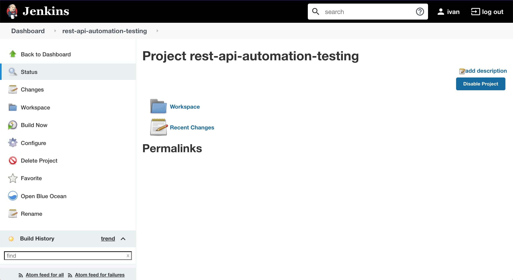

# `postman-newman-jenkins`

The goal of this project is to implement an **Automation Testing** for a REST API. We will use
[Postman](https://www.getpostman.com), [Newman](https://github.com/postmanlabs/newman) (that is the command line
Collection Runner for Postman) and [Jenkins](https://jenkins.io). The REST API to be tested will be
[`ReqRes`](https://reqres.in), that is a fake online REST API. 

### Note

A new image `docker.mycompany.com/postman-newman-jenkins:2.165` is build from the `Jenkins` base image
`jenkins/jenkins:2.165`.

> _"We need to give the jenkins user sudo privileges in order to be able to run Docker commands inside the container.
Alternatively we could have added the jenkins user to the Docker group, which avoids the need to prefix all Docker
commands with ‘sudo’, but is non-portable due to the changing gid of the group"_ [1]

# Start environment

## Test Postman Collection in Host Machine

- Open a terminal and go to `/postman-newman-jenkins` root folder

- In order to run the `Postman` collection present in `\postman` folder without `Jenkins`, execute the following
command. It will start `Newman` docker container
```
docker run -t --rm --name newman -v $PWD/postman:/etc/newman \
postman/newman_ubuntu1404:4.3.1 run ReqRes.postman_collection.json -g ReqRes.postman_globals.json
```

## Docker Compose

- Export to `DOCKER_PATH` environment variable the docker path in host machine
```
export DOCKER_PATH=$(which docker)
```

- Inside `/postman-newman-jenkins` root folder and run
```
docker-compose up -d
```
> To stop and remove containers, networks and volumes type:
> ```
> docker-compose down -v
> ```

- Wait a little bit so that `jenkins` container is `Up`.

- To check their status run
```
docker-compose ps
```

## Jenkins

- Get the Jenkins installation password
```
docker logs jenkins
```
You should see something similar to
```
*************************************************************
*************************************************************
*************************************************************

Jenkins initial setup is required. An admin user has been created and a password generated.
Please use the following password to proceed to installation:

1b5964b8c7a648e584a994fbb293c05f

This may also be found at: /var/jenkins_home/secrets/initialAdminPassword

*************************************************************
*************************************************************
*************************************************************
```

- Access Jenkins: http://localhost:9090

- Inform the installation password.

- Select the default installation option, `Install suggested plugins`. It will take a few minutes to complete.

- Create an admin account.

- Proceed normally with the setup using the default values.

- On the main Jenkins interface, click on `New item` on the menu.

- Enter a name `rest-api-automation-testing`

- Select `Freestyle project` and click on `OK` button. 

- On the next screen, go to `Build` section

- Click on `Add build step` and select `Execute shell`

- Fill the `Command` field with the command below
```
sudo docker run --rm postman/newman_ubuntu1404:4.3.1 \
run "https://raw.githubusercontent.com/ivangfr/postman-newman-jenkins/master/postman/ReqRes.postman_collection.json" \
-g "https://raw.githubusercontent.com/ivangfr/postman-newman-jenkins/master/postman/ReqRes.postman_globals.json" \
--disable-unicode --color off
```

- Click on `Save` button at the bottom of the page

- Your Jenkins project is created. You should see something like


- In order to run the project, click on `Build Now` menu item on the left.
> The test cases are a little bit strict. They require that the response time must be below 1000 ms. So, depending on
how fast `ReqRes` online REST API replies to you request, maybe some test cases will fail and, consequently, the build
will fail. 

- To see the execution results, click on the red or blue balls that appears inside `Build History` (section on the left)
everytime you build the Jenkins project. You should get an output like
```
Started by user admin
Building in workspace /var/jenkins_home/workspace/rest-api-automation-testing
[rest-api-automation-testing] $ /bin/sh -xe /tmp/jenkins3148741983294114742.sh
+ sudo docker run --rm postman/newman_ubuntu1404:4.3.1 run https://raw.githubusercontent.com/ivangfr/postman-newman-jenkins/master/postman/ReqRes.postman_collection.json -g https://raw.githubusercontent.com/ivangfr/postman-newman-jenkins/master/postman/ReqRes.postman_globals.json --disable-unicode --color off
newman

ReqRes

Root Get List of Users
  GET https://reqres.in/api/users [200 OK, 1010B, 899ms]
  Pass  Status code is 200
  Pass  Content-Type is present
  Pass  Response time is less than 1000ms
  Pass  Page Schema is valid
  Pass  Field values

Root Get Single User
  GET https://reqres.in/api/users/2 [200 OK, 563B, 278ms]
  Pass  Status code is 200
  Pass  Content-Type is present
  Pass  Response time is less than 1000ms
  Pass  User Schema is valid
  Pass  Field values

Root Get Nonexistent User
  GET https://reqres.in/api/users/20 [404 Not Found, 401B, 220ms]
  Pass  Status code is 404
  Pass  Content-Type is present
  Pass  Response time is less than 1000ms

Root Post User
  POST https://reqres.in/api/users [201 Created, 482B, 272ms]
  Pass  Status code is 201
  Pass  Content-Type is present
  Pass  Response time is less than 1000ms
  Pass  User Schema is valid

Root Put User
  PUT https://reqres.in/api/users/2 [200 OK, 498B, 273ms]
  Pass  Status code is 200
  Pass  Content-Type is present
  Pass  Response time is less than 1000ms
  Pass  User Schema is valid

Root Delete User
  DELETE https://reqres.in/api/users/2 [204 No Content, 334B, 212ms]
  Pass  Status code is 204
  Pass  Response time is less than 1000ms

-------------------------------------------------
|                         | executed |   failed |
--------------------------+----------+-----------
|              iterations |        1 |        0 |
--------------------------+----------+-----------
|                requests |        6 |        0 |
--------------------------+----------+-----------
|            test-scripts |       12 |        0 |
--------------------------+----------+-----------
|      prerequest-scripts |        6 |        0 |
--------------------------+----------+-----------
|              assertions |       23 |        0 |
-------------------------------------------------
| total run duration: 2.6s                      |
-------------------------------------------------
| total data received: 737B (approx)            |
-------------------------------------------------
| average response time: 359ms                  |
-------------------------------------------------
Finished: SUCCESS
```

# References

[1] Running Docker in Jenkins (in Docker): https://container-solutions.com/running-docker-in-jenkins-in-docker